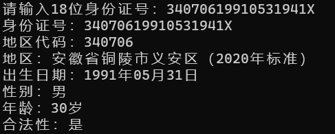

# “中华人民共和国公民身份号码”验证工具



该工具使用 `C++` 编写，标准采用`C++ 14`，
支持 **Windows** 下 `MSVC` 编译器；
支持 **Linux** 下 `GCC\Clang` 编译器。

## 使用方法

### 第一步： 编译项目（也可直接下载release版本跳过） 
1. 自行编译代码，推荐使用`CLion`作为开发环境；
2. 将文件 [address_code.csv](address_code.csv) 放置在可执行文件同级目录；

### 第二步：准备身份证号，运行
* 可通过直接运行可执行文件，例如： ```ChinaIdNumberCheck.exe```，输入身份证号；

* 或则将号码作为唯一参数，例如：
  ```ChinaIdNumberCheck.exe 34070619910531941X```


## 备注
* 因为结果通过终端打印，涉及到中文字符，请保证系统存在中文环境，尤其是 Linux 下最好使用`zh_CN.UTF-8`环境。

* 号码对应地区字典，来自于 [jxlwqq/address-code-of-china](https://github.com/jxlwqq/address-code-of-china) 项目。